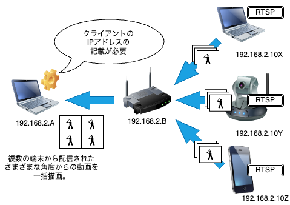

# playbackCamera
## 概要:
### 動画の遅延表示: 
playbackCameraは、撮影した動画を遅らせて表示するためのソフトウェアです。  
スポーツのフォームをさまざまな視点で確認するために作成しました。

### ネットワークカメラ／スマートフォンなどからのリアルタイム配信:
リアルタイム動画配信プロトコルであるRTSP形式の動画を受信することができます。  
これにより、ユーザーは様々なソースからの映像を取り込むことができます。  
- スマートフォン
- PC
- ネットワークカメラ（一般的には15fpsが主流）



*一部ネットワークの知識(IPアドレスの把握、カメラ・サーバのネットワークの構築)が必要です。  

### 複数カメラの映像を同時出力:
このソフトウェアは、最大4台のカメラ映像を同時に出力することが可能です。  
これにより、ユーザーは異なる角度からの映像を同時に確認することができます。

## インストール方法について
### Windows
Gitが入っていない場合はGitをインストール
```
winget install --id Git.Git -e --source winget
```
Anacondaにて仮想環境を構築
```
winget install --id Anaconda.Anaconda3 -e
```
以下のメッセージが出たら、Yを入力  
  
すべてのソース契約条件に同意しますか?  
[Y] はい  [N] いいえ: y

コマンドプロンプトを開きなおす。
```
conda create --name playbackcamera
conda activate playbackcamera
install.bat
```
